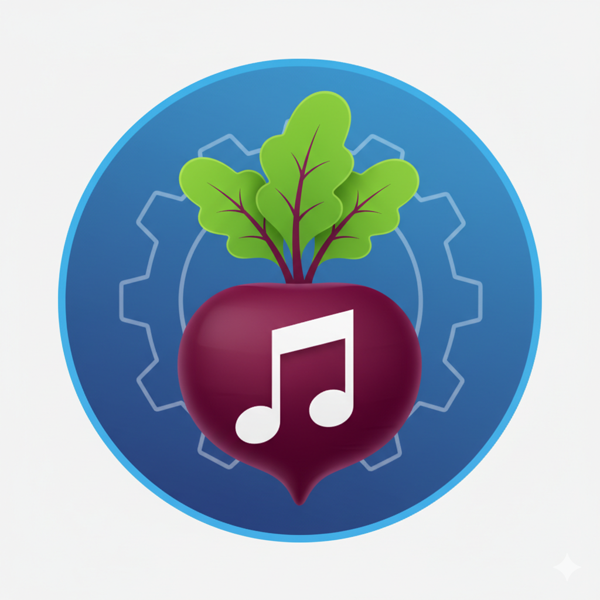

# 🎵 Beet Telegram Bot



Interactive Telegram bot for managing music imports with Beets. Features automatic plugin detection, multi-source metadata support (MusicBrainz + Discogs), and a smart adaptive UI.

## ✨ Key Features

- 🔌 **Automatic Plugin Detection** - Adapts UI based on enabled beet plugins
- 🎯 **Smart Import Flows** - Single match, multiple candidates, or manual ID entry
- 🌐 **Multi-Source Metadata** - MusicBrainz and Discogs support
- 📊 **Rich Previews** - See differences before confirming imports
- 🖼️ **Image Management** - View and send album artwork
- 🌍 **Multi-Language** - English and Italian (easily extensible)
- 💾 **State Persistence** - Resume imports after restart
- 🔒 **Secure** - Single-user access control

## 📁 Project Structure

```
beet-telegram-bot/
├── bot.py                      # Entry point with plugin detection
├── config.py                   # Configuration management
├── requirements.txt            # Python dependencies
├── Dockerfile                  # Docker image definition
├── docker-compose.yml          # Container orchestration
├── .env                        # Environment variables (create this)
│
├── core/                       # Business logic
│   ├── beet_manager.py        # Import manager with unified schema
│   ├── directory_analyzer.py  # Smart directory structure detection
│   ├── parsers.py             # Advanced beet output parser
│   └── plugin_detector.py     # Automatic plugin detection system
│
├── handlers/                   # Telegram event handlers
│   ├── commands.py            # Bot commands (/start, /list, /status, etc.)
│   ├── callbacks.py           # Inline button handlers with validation
│   └── messages.py            # Text input handlers (IDs, confirmations)
│
├── ui/                         # User interface components
│   ├── keyboards.py           # Dynamic keyboard generation
│   └── messages.py            # Message formatting with MarkdownV2
│
├── i18n/                       # Internationalization
│   ├── translations.py        # Translation system
│   └── locales/
│       ├── it.json            # Italian translations
│       └── en.json            # English translations
│
└── bot_state/                  # Runtime data (auto-created)
    └── beet_import_state.json # Persistent import state
```

## 🚀 Quick Start

### 1. Prerequisites

- Docker and Docker Compose installed
- Existing [Beets](https://beets.io/) installation (Docker recommended)
- Telegram account

### 2. Create Telegram Bot

```bash
# Talk to @BotFather on Telegram
/newbot
# Follow prompts and save the token

# Get your Chat ID from @userinfobot
/start
# Copy your Chat ID
```

### 3. Setup Project

```bash
# Create project directory
mkdir ~/beet-telegram-bot
cd ~/beet-telegram-bot

# Create all files from the structure
# (copy contents from the codebase)

# Create bot_state directory
mkdir -p bot_state
```

### 4. Configure Environment

Create `.env` file:

```env
# Telegram Configuration
TELEGRAM_BOT_TOKEN=123456789:ABCdefGHIjklMNOpqrsTUVwxyz
TELEGRAM_CHAT_ID=987654321

# Beet Container Configuration
BEET_CONTAINER=beets              # Name of your beets container
BEET_USER=abc                     # User inside beets container
BEET_LIBRARY=/music               # Library path (inside container)
IMPORT_PATH=/downloads            # Import directory (inside container)

# Optional: Custom Commands
CUSTOM_COMMANDS=[{"cmd": "stats", "action": "beet stats", "desc": "Check library stats"}]

# Bot Configuration
LANGUAGE=en                       # en | it
LOG_LEVEL=INFO                    # DEBUG | INFO | WARNING | ERROR
DIFF_STYLE=smart                  # char | word | smart | simple

# Beet Behavior
BEET_DEBUG_MODE=false             # Show verbose beet output
BEET_PRETEND=false                # Dry-run mode (test without importing)

# Docker Configuration
PUID=1000                         # User ID for file permissions
PGID=1000                         # Group ID for file permissions
TZ=America/New_York               # Timezone
```

### 5. Configure Docker Compose

Edit `docker-compose.yml` to match your paths:

```yaml
volumes:
  # Map your actual import directory
  - /home/user/imports:/downloads
  
  # Map your music library (read-only recommended)
  - /home/user/Music:/music:ro
  
  # Bot state persistence
  - ./bot_state:/app/bot_state
```

If your beets container is on a different network:

```yaml
networks:
  beet-network:
    external: true
    name: your_existing_network
```

### 6. Start the Bot

```bash
# Build and start
docker-compose up -d --build

# View logs
docker-compose logs -f beet-bot

# Check plugin detection
docker-compose logs beet-bot | grep "Detected plugins"
```

Expected output:
```
🔍 Detecting beet plugins...
✅ Detected plugins: discogs, fetchart, lyrics
📚 Available metadata sources: musicbrainz, discogs
🤖 Bot started!
```

## 📋 Bot Commands

| Command | Description |
|---------|-------------|
| `/start` | Display welcome message and available commands |
| `/list` | Show all directories ready for import with sizes |
| `/status` | Check current import status and progress |
| `/cancel` | Cancel the active import operation |
| Custom commands | Any commands defined in `CUSTOM_COMMANDS` |

### Custom Commands

Add custom beet commands via environment variable:

```env
CUSTOM_COMMANDS=[
  {"cmd": "config", "action": "beet config", "desc": "Verify beet config file"},
  {"cmd": "update", "action": "beet update", "desc": "Update library database"},
  {"cmd": "stats", "action": "beet stats", "desc": "Show library statistics"}
]
```

These will appear in the bot menu and can be invoked like `/config`, `/update`, etc.

## 🎯 Import Workflows

The bot supports four distinct import flows:

### Flow A: No Match Found

```
1. Start import → No matches found
2. Options shown:
   - 🔍 Search MusicBrainz (web link)
   - 🔍 Enter MusicBrainz ID manually
   - 💿 Enter Discogs ID manually (if plugin enabled)
   - 📦 Import as-is (no metadata)
   - ⏭️ Skip this album
```

### Flow B: Single Match (Automatic)

```
1. Start import → One match found (e.g., 95.3% similarity)
2. Preview shown:
   - Artist, Album, Year
   - Differences highlighted
   - Link to source (MusicBrainz/Discogs)
3. Click "✅ Accept Match" → Import completed
```

### Flow C: Multiple Candidates

```
1. Start import → Multiple matches found
2. List of candidates shown (1️⃣ 2️⃣ 3️⃣...)
3. Click a candidate → Preview shown
4. Click "✅ Confirm Import" → Import completed
```

### Flow D: Manual ID Entry

```
1. Click "🔍 MusicBrainz ID" or "💿 Discogs ID"
2. Bot prompts for ID
3. Enter ID (e.g., abc123-def456-...)
4. Preview shown with differences
5. Click "✅ Confirm Import" → Import completed
```

## 🔌 Plugin System

The bot automatically detects which beet plugins are enabled and adapts accordingly.

### Supported Metadata Sources

#### MusicBrainz (Needed)
Beet's default metadata source. In the latest beet versions must be enabled.

#### Discogs (Optional)
Requires the `discogs` plugin in your beet configuration.

**To enable Discogs:**

```yaml
# ~/.config/beets/config.yaml (or inside beet container)

plugins: discogs fetchart lyrics lastgenre

discogs:
    source_weight: 0.5
    user_token: your_discogs_token_here
```

Get a token at: [Discogs Developer Settings](https://www.discogs.com/settings/developers)

### UI Adaptation

**With Discogs Enabled:**
```
Buttons: [🔍 MusicBrainz] [💿 Discogs]
Input:   [🔍 MB ID] [💿 Discogs ID]
```

**Without Discogs:**
```
Buttons: [🔍 MusicBrainz]
Input:   [🔍 MB ID]
```

### Plugin Compatibility

#### ✅ Safe Plugins
These work perfectly with the bot:
- `musicbrainz` - Default metadata
- `discogs` - Alternative metadata
- `fetchart` - Album artwork
- `lyrics` - Song lyrics
- `lastgenre` - Genre tagging
- `chroma` - Acoustic fingerprinting
- `replaygain` - Volume normalization
- `embedart` - Embed artwork
- `scrub` - Clean tags
- `convert` - Format conversion

**Recommendation:** Keep your plugin list clean and disable interactive plugins:

```yaml
plugins: musicbrainz discogs fetchart lyrics lastgenre scrub
```

### Plugin Detection

The bot caches plugin detection for 5 minutes. To refresh:

```bash
# Restart the bot
docker-compose restart beet-bot

# Or force refresh by changing beet config and waiting 5 minutes
```

View detected plugins in logs:

```bash
docker-compose logs beet-bot | grep plugins
```

## 🎨 Features in Detail

### 📂 Directory Management

**Structure Detection:**
- Automatic single/multi-disc detection
- CD1, CD2, Disc 1, Disc 2 patterns supported
- Track count and size calculation per disc
- Image detection (cover.jpg, artwork, etc.)

**Operations:**
- List all import directories with size
- View detailed file list (up to 80 files shown)
- Preview images (up to 10 sent)
- Delete directories with confirmation
- Skip albums (moves to `/imports/skipped/`)

**Multi-Disc Example:**
```
The_Wall/
├── CD1/
│   ├── 01 In the Flesh.flac
│   ├── 02 The Thin Ice.flac
│   └── ...
├── CD2/
│   ├── 01 Hey You.flac
│   └── ...
└── cover.jpg
```

Bot detects: "💿 Multi-disc album (2 discs)"

### 🔍 Smart Search

**Query Generation:**
Directory name `Pink_Floyd-The_Wall_(1979)_[FLAC]` becomes:
- Search query: `Pink Floyd The Wall 1979`
- Removes brackets, special chars, common tags

**Search Links:**
- Direct to MusicBrainz search with query
- Direct to Discogs search (if enabled)
- One click from bot to web search

### 📊 Import Previews

**Difference Highlighting:**

The bot shows character-level diffs using smart formatting:

```
Original: The Wall (Remastered)
Match:    The Wall — Remaster

Shown as:
• 🔄 album: The Wall ~~(Remastered)~~ → __*— Remaster*__
```

**Diff Styles:**

Configure via `DIFF_STYLE` environment variable:

- `char` - Character-by-character (best for small changes)
- `word` - Word-by-word (better readability)
- `smart` - Automatic choice based on length (recommended)
- `simple` - Just show new value

**Preview Information:**
- Artist, Album, Year, Label, Catalog Number
- Similarity percentage
- List of differences (first 15 shown)
- Track changes with time codes
- Direct link to MusicBrainz/Discogs release

### 🌍 Internationalization

**Current Languages:**
- 🇬🇧 English (`en`)
- 🇮🇹 Italian (`it`)

**Change Language:**

```bash
# Edit .env
LANGUAGE=it

# Restart
docker-compose restart beet-bot
```

**Add New Language:**

1. Create `i18n/locales/fr.json`
2. Copy structure from `en.json`
3. Translate all keys
4. Set `LANGUAGE=fr`

Example:
```json
{
  "commands": {
    "start": "🎵 *Gestionnaire d'Import Beet*\n\n..."
  },
  "buttons": {
    "start_import": "▶️ Démarrer l'import"
  }
}
```

### 💾 State Persistence

**Automatic Save:**
- Current import state saved after each step
- Survives bot restarts
- Stored in `/tmp/beet_import_state.json`

**Resume After Restart:**
```bash
# Bot crashes or restarts
docker-compose restart beet-bot

# User can continue where they left off
/status  # Shows previous import state
```

**Manual State Management:**
```bash
# View state file
docker exec beet-bot cat /tmp/beet_import_state.json

# Clear state manually
docker exec beet-bot rm /tmp/beet_import_state.json
```

## 🔧 Advanced Configuration

### Logging Levels

```env
LOG_LEVEL=DEBUG  # Most verbose, for troubleshooting
LOG_LEVEL=INFO   # Normal operation (recommended)
LOG_LEVEL=WARNING # Only warnings and errors
LOG_LEVEL=ERROR   # Only errors
```

### Debug Mode

```env
BEET_DEBUG_MODE=true  # Show full beet output in logs
```

Useful for:
- Understanding why imports fail
- Debugging plugin issues
- Seeing exact beet commands

### Pretend Mode

```env
BEET_PRETEND=true  # Test imports without actually importing
```

All imports run with `--pretend` flag. Will break bot UI flow. Great for:
- Testing new configurations
- Verifying plugin behavior
- Dry-run

### Custom Diff Highlighting

```env
# Character-level (shows every char difference)
DIFF_STYLE=char

# Word-level (cleaner for long text)
DIFF_STYLE=word

# Smart choice based on length (recommended)
DIFF_STYLE=smart

# Simple (just underline new text)
DIFF_STYLE=simple
```

### Network Configuration

**Shared Network with Beets:**

```yaml
# docker-compose.yml
services:
  beet-bot:
    networks:
      - beet-network

networks:
  beet-network:
    external: true
    name: existing_beets_network
```

**Bridge Network:**

```yaml
networks:
  beet-network:
    driver: bridge
```

### File Permissions

Match user/group IDs with your host system:

```env
PUID=1000  # Your user ID (run: id -u)
PGID=1000  # Your group ID (run: id -g)
```

Fix permissions if needed:

```bash
# On host
sudo chown -R 1000:1000 /path/to/imports
sudo chmod -R 775 /path/to/imports
```

## 🐛 Troubleshooting

### Bot Not Responding

**Check bot logs:**
```bash
docker-compose logs -f beet-bot
```

**Common issues:**
- Wrong `TELEGRAM_BOT_TOKEN`
- Wrong `TELEGRAM_CHAT_ID`
- Network issues

**Verify configuration:**
```bash
docker exec beet-bot env | grep TELEGRAM
```

### Cannot Connect to Beets Container

**Check beets is running:**
```bash
docker ps | grep beet
```

**Test beet command:**
```bash
docker exec -u abc beets beet version
```

**Common issues:**
- Wrong `BEET_CONTAINER` name
- Wrong `BEET_USER` name
- Beets container not running
- Network isolation

**Verify:**
```bash
docker-compose exec beet-bot docker exec beets beet config
```

### Discogs Buttons Not Showing

**Check plugin detection:**
```bash
docker-compose logs beet-bot | grep "Detected plugins"
```

**Manually verify:**
```bash
docker exec beets beet config | grep plugins
```

**If discogs is listed but not detected:**
- Check `beet config` output format
- Enable `BEET_DEBUG_MODE=true`
- Check logs for parsing errors

**Force plugin refresh:**
```bash
docker-compose restart beet-bot
```

### Import Hangs or Freezes

**Increase timeout:**

Edit `core/beet_manager.py`:
```python
result = subprocess.run(..., timeout=600)  # 10 minutes instead of 5
```

**Check for interactive plugins:**
```bash
docker exec beets beet config | grep plugins
```

Remove: `edit`, `web`, `importadded`

**Enable debug mode:**
```env
BEET_DEBUG_MODE=true
LOG_LEVEL=DEBUG
```

### File Permission Errors

**Check ownership:**
```bash
ls -la /path/to/imports
```

**Fix permissions:**
```bash
sudo chown -R $USER:$USER /path/to/imports
chmod -R 755 /path/to/imports
```

**Match Docker user:**
```bash
# Get your IDs
id -u  # Use this for PUID
id -g  # Use this for PGID
```

Update `.env` and restart:
```bash
docker-compose down
docker-compose up -d --build
```

### Unicode/Encoding Errors

**Ensure UTF-8:**
```bash
# In Dockerfile
ENV LANG=C.UTF-8
ENV LC_ALL=C.UTF-8
```

**Verify beets config:**
```yaml
# In beet config
musicbrainz:
  encoding: utf-8
```

## 🧪 Testing

### Test Plugin Detection

```bash
docker-compose exec beet-bot python3 -c "
from core.plugin_detector import get_plugin_detector
detector = get_plugin_detector()
plugins = detector.get_enabled_plugins()
print(f'Plugins: {plugins}')
print(f'Has Discogs: {detector.has_discogs()}')
print(f'Sources: {detector.get_metadata_sources()}')
"
```

### Test Import Dry-Run

```env
BEET_PRETEND=true
```

Start an import - it will simulate without actually importing.

### Manual Testing

```bash
# Test beet connection
docker exec -u abc beets beet version

# Test import manually
docker exec -i -u abc beets beet import -p /downloads/Test_Album

# Check plugin list
docker exec beets beet config | grep -A 5 plugins
```

## 📊 Usage Examples

### Example 1: Basic Import

```
1. Copy album → /imports/Pink_Floyd-The_Wall/
2. Open Telegram bot
3. /list
4. Click "📁 Pink_Floyd-The_Wall (450 MB)"
5. View: 26 tracks, 2 images
6. Click "▶️ Start Import"
7. Match found: 96.8%
8. Click "✅ Accept Match (96.8%)"
9. ✅ Import completed!
```

### Example 2: Manual ID

```
1. Import started → Multiple candidates
2. None match exactly
3. Click "🔍 Search MusicBrainz"
4. Find correct release → Copy ID
5. Back to bot → "🔍 MusicBrainz ID"
6. Paste ID: abc123-def456-...
7. Preview shown with differences
8. Click "✅ Confirm Import"
9. ✅ Import completed!
```

### Example 3: Discogs Import

```
1. Album not in MusicBrainz
2. Click "💿 Search Discogs"
3. Find release → Copy URL or ID
4. Back to bot → "💿 Discogs ID"
5. Paste: r123456 (or just: 123456)
6. Preview shown
7. Click "✅ Confirm Import"
8. ✅ Import completed!
```

### Example 4: Multi-Disc Album

```
1. Import structure:
   Album/
   ├── CD1/ (15 tracks)
   ├── CD2/ (12 tracks)
   └── cover.jpg

2. Bot automatically detects:
   "💿 Multi-disc album (2 discs)"
   
3. Shows:
   CD1: 🎵 15 tracks (185 MB)
   CD2: 🎵 12 tracks (156 MB)
   🖼️ 1 image in main directory

4. Import proceeds normally
5. Both discs imported with correct disc numbers
```

## 🛠️ Development

### Local Development (Without Docker)

```bash
# Install dependencies
pip install -r requirements.txt

# Export environment variables
export TELEGRAM_BOT_TOKEN=your_token
export TELEGRAM_CHAT_ID=your_chat_id
export LANGUAGE=en
export BEET_CONTAINER=beets
export BEET_USER=abc

# Run bot
python bot.py
```

### Project Architecture

**Separation of Concerns:**
- `core/` - Business logic, no Telegram dependencies
- `handlers/` - Telegram-specific event handling
- `ui/` - User interface generation
- `i18n/` - Internationalization

**Key Design Patterns:**
- Manager pattern (`BeetImportManager`)
- State persistence (JSON serialization)
- Plugin detection with caching
- Unified import result schema

**Adding Features:**

1. **New command:**
   - Add handler in `handlers/commands.py`
   - Register in `bot.py`
   - Add translations in `i18n/locales/*.json`

2. **New button:**
   - Add button in `ui/keyboards.py`
   - Add handler in `handlers/callbacks.py`
   - Add translation key

3. **New import flow:**
   - Modify `core/beet_manager.py`
   - Update parser in `core/parsers.py`
   - Update UI in `ui/messages.py`

### Code Style

**Python:**
- Follow PEP 8
- Use type hints where helpful
- Document complex functions
- Keep functions focused and small

**Logging:**
```python
logger.debug("Detailed info for development")
logger.info("Important events")
logger.warning("Recoverable issues")
logger.error("Errors that need attention")
```

**Error Handling:**
```python
try:
    result = risky_operation()
except SpecificException as e:
    logger.error(f"Operation failed: {e}")
    # Inform user gracefully
```

## 🔐 Security

### Access Control
- Bot only accepts commands from configured `CHAT_ID`
- No web interface exposed
- No external ports needed

### Docker Security
- Runs as non-root user (`PUID`/`PGID`)
- Read-only mounts where possible
- Minimal attack surface

### Recommendations
- Don't share your bot token
- Use a dedicated Telegram account for imports
- Keep the bot private (don't add to groups)
- Regularly update dependencies

```bash
# Update bot
git pull
docker-compose down
docker-compose up -d --build

# Update dependencies
pip install -U -r requirements.txt
```

## 📈 Performance

### Optimization Tips

**Plugin Detection Caching:**
- Plugins cached for 5 minutes
- Reduces `beet config` calls
- Minimal overhead

**Import Timeouts:**
- Default: 5 minutes
- Increase for large collections
- Adjust in `beet_manager.py`

**Message Sending:**
- Images batched (max 10)
- Long messages split automatically
- Efficient keyboard updates

**Memory Usage:**
- State file minimal (~10KB)
- No heavy caching
- Clean up after imports

### Monitoring

```bash
# Resource usage
docker stats beet-bot

# Bot logs
docker-compose logs -f --tail=100 beet-bot

# Import statistics
docker exec beets beet stats
```

## 🤝 Contributing

Contributions welcome! Areas that need help:

- 🌍 **Translations** - Add more languages
- 🧪 **Tests** - Unit and integration tests
- 📚 **Documentation** - Improve guides and examples
- 🎨 **UI** - Better message formatting
- 🔌 **Plugins** - Support more beet plugins
- 🐛 **Bug fixes** - Report and fix issues

**How to contribute:**

1. Fork the repository
2. Create a feature branch
3. Make your changes
4. Test thoroughly
5. Submit a pull request

## 📝 Changelog

### v2.0.0 (Current)
- 🔌 Automatic plugin detection
- 🎯 Unified import flow system
- 📊 Advanced diff highlighting
- 🌐 Improved Discogs support
- 💾 Better state persistence
- 🎨 Adaptive UI based on plugins
- 🐛 Many bug fixes

### v1.0.0 (Initial)
- Basic import functionality
- MusicBrainz support
- Italian translation
- Docker support

## 📜 License

MIT License - Free to use and modify!

## 🙏 Credits

Built with love using:

- **[Beets](https://beets.io/)** - The music library manager
- **[python-telegram-bot](https://github.com/python-telegram-bot/python-telegram-bot)** - Telegram Bot API
- **[linuxserver.io](https://docs.linuxserver.io/images/docker-beets/)** - Beets Docker image
- **[MusicBrainz](https://musicbrainz.org/)** - Music metadata database
- **[Discogs](https://www.discogs.com/)** - Music database and marketplace
- **[Claude AI](https://claude.ai)** - Development assistant

Special thanks to the open-source community!

## 📞 Support

- 📖 [Beets Documentation](https://beets.readthedocs.io/)
- 💬 [Telegram Bot API](https://core.telegram.org/bots/api)
- 🐛 Report issues on GitHub
- 💡 Feature requests welcome

---

**Made with ❤️ for music lovers who want perfectly organized libraries**

*"Because your music deserves better than random folders and missing metadata!"*
